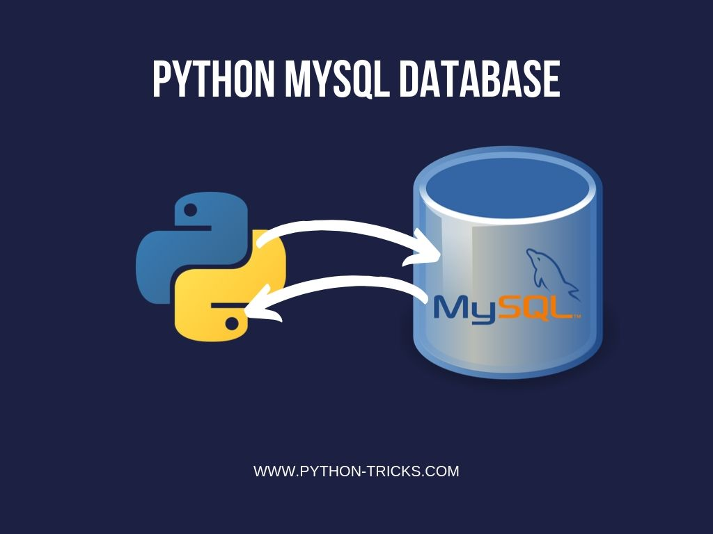
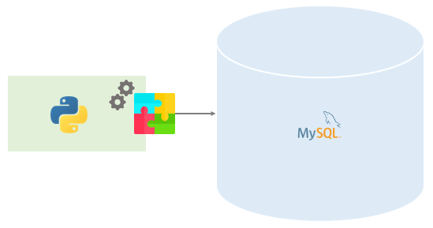

# Establishing a MYSQL/Python Connection and running Queries

Many of the web applications we encounter daily rely on MySQL databases to efficiently handle data transmission and storage. 

A significant number of these applications are developed using Python, making the integration of Python-based applications with MySQL databases a crucial aspect of modern data-driven projects.

## Connecting Python with a MySQL database. 
Python communicates with MySQL using the **mysql-connector**. This is an external library that acts as a driver. It converts Python string objects into viable SQL statements that can be executed on MySQL.

The results of these SQL statements are then parsed and returned to the Python client in a manner that is compatible with Python datatypes and structures. 

To connect with a MySQL backend database, a Python client program must furnish the appropriate connection parameters. 

These parameters typically include specifying the following information: 

* the host,
* the server,
* the target database,
* and username and passwords.

The attached [notebook](databaseClients.ipynb) contains complete code snippets.

The following display the codes for a typical connection with a MySQL database using a Python MySQL connector class:

```
pip install mysql.conenector
import mysql.connector as connector
from mysql.connector import errorcode
```

### Step 1: Installing the MySQL Connector Python Package
```
pip install mysql.conenector
```
In this first step, you are using the `pip` command to install the mysql.connector package. This package is essential for connecting Python applications to MySQL databases.

### Step 2: Importing the MySQL Connector Module
```
import mysql.connector as connector
from mysql.connector import errorcode
```
In this step, you import the necessary modules for connecting to a MySQL database. The primary module is `mysql.connector`. You also import the `errorcode` module to handle errors gracefully during the database connection process.

### Step 3: Establishing a Connection to the MySQL Database
```
connection = connector.connect(user="root", password="your_password")

```
Here, you are creating a connection to your MySQL database. You specify the username and password to access the database. Replace `"your_password"` with the actual password you've set for the MySQL server.

### Step 4: Handling Connection Errors
There are many potential issues that can arise when connecting to a database which can cause your application to crash unexpectedly in a production environment.

To avoid these issues, it’s a good idea to use Python’s try/except error handling, as in the following example:
```
try:
    connection = connector.connect(user = 'root', password = 'Your Password')
except connector.Error as err:
    if err.errno == errorcode.ER_ACCESS_DENIED_ERROR:
        print("Username or password is incorrect")
    elif err.errno == errorcode.ER_BAD_DB_ERROR:
        print("Database does not exist")
    else:
        print(err)
```
- In this step, you initiate a try-except block to handle potential errors that may occur during the process of connecting to a MySQL database. The `try` block attempts to create a database connection using the specified username and password.

- Inside the `except` block, you check for specific error types using the `err.errno` attribute. Here's what each condition checks:

    1. `err.errno == errorcode.ER_ACCESS_DENIED_ERROR`: This condition checks if the error code indicates an access denied error. It typically occurs when the provided username or password is incorrect. In this case, you print a message to inform the user that either the username or password is incorrect.

    2. `err.errno == errorcode.ER_BAD_DB_ERROR`: This condition checks if the error code suggests that the specified database does not exist. If the database is missing, you print a message to notify the user.

    3. If none of the specific error conditions are met, the else block is executed. In this case, you print the error message itself using `print(err)`. This provides a more detailed error message for cases not covered by the specific conditions.

This code is essential for gracefully handling potential errors during the MySQL database connection process. It provides meaningful error messages to users, indicating the nature of the problem, whether it's related to incorrect login credentials or a missing database.

By including these error-handling mechanisms, your Python application can provide valuable feedback to users, making it easier to diagnose and resolve issues when connecting to MySQL databases.


### Step 5: Utilize the Cursor Object
```
cursor = connection.cursor()
```
- In this step, a cursor object is created by invoking the `cursor()` method on the database connection, which is represented by the connection variable.

- **What Is a Cursor?**

    A cursor is a pointer that directs the Python client to the results of your SQL query within the MySQL database. The cursor indicates the location of the queried data by identifying specific roles or records. You can use a cursor to read, retrieve and move through individual records within the results of your query. Cursors have several key characteristics or features that are particularly useful to database engineers.

- **Why Use a Cursor?**

    Databases can return large result sets, and a cursor is an efficient way to handle these sets. The cursor keeps track of the current position in the result set, so you can process one row at a time without having to load the entire result set into memory. This is particularly important when working with large databases or complex queries.

- **How to Use the Cursor**
    
    Once you have a cursor object (cursor in this case), you can use it to execute SQL queries, fetch data from the database, and perform other database operations. Here are some common operations you can perform with the cursor:

1. `cursor.execute(sql_query)`: You can use the execute() method to run SQL queries. This is how you send SQL commands to the database for execution.

2. `cursor.fetchone()`: Use fetchone() to retrieve the next row from the result set.

3. `cursor.fetchall()`: This method retrieves all the remaining rows from the result set.

4. `cursor.fetchmany(size)`: You can use this method to fetch a specific number of rows at a time, specified by the size parameter.

5. `cursor.close()`: After you've finished using the cursor, it's a good practice to close it to free up resources and ensure proper cleanup.

### Step 6: Execute Queries:
```
cursor.execute("CREATE DATABASE IF NOT EXISTS little_lemon")
```
In this line, we are using the cursor object (cursor) to execute an SQL command. The command is "CREATE DATABASE IF NOT EXISTS little_lemon".

The execute method is part of the MySQL Connector Python library, and it allows you to send SQL commands directly to the MySQL server. In this case, the SQL command is encapsulated within the double quotes and passed as an argument to `execute()`.

```
cursor.execute("SHOW DATABASES")
databases = cursor.fetchall()

# Fetch and print the results
for database in databases:
    print(database)
```
The `fetchall()` method retrieves all the results returned by the SQL query and stores them in the databases variable. The results are typically returned as a list of tuples, with each tuple containing the name of a database.

We then iterate through each item in the databases list, which contains the names of the available databases. For each database name, we print it to the console.

After execution, this code block will print the names of all the databases available on the MySQL server. It's a useful way to check and confirm which databases exist, especially when working with a MySQL server with multiple databases.

## Conclusion
In conclusion, this article has provided a step-by-step guide on how to connect to a MySQL server using Python and the MySQL Connector/Python library. We've covered essential concepts, such as establishing a connection, handling potential errors, creating databases, and listing existing databases.


It's important to note that the principles discussed here extend beyond listing databases. The same logic can be applied to execute various SQL statements, from creating tables and inserting data to querying and updating records. Then python notebook demonstrates more [here](databaseClients.ipynb).

As you delve deeper into working with MySQL databases, you'll find that Python's flexibility and the MySQL Connector/Python library's capabilities empower you to accomplish a wide range of database tasks.

Stay curious and keep exploring the vast possibilities of combining Python and MySQL for your data needs. The journey has just begun, and you're well-equipped to embark on it. Happy coding!
